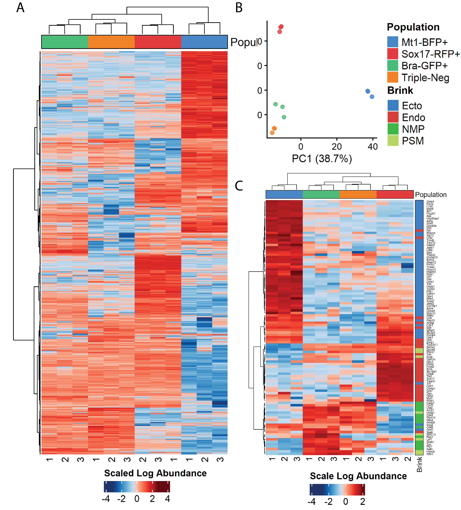

## Proteomic analyses of mouse gastruloids — From bulk to single-cell proteomics

**Abstract:** Gastruloid generated from three-dimensional aggregates of embryonic stem cells has been proved to exhibiting gastrulation-like events, which can be used as an in vitro model to study germ layer specification. Whereas germ layer-specific cell types in gastruloids have been explored in several transcriptome studies, research on transcripts alone do not ensure insight into entire cellular domains as the vast majority of biological programs are carried out by proteins. However, very little is known about germ layer-specific proteomes. Here, we investigated the proteomes of germ layer lineages derived 120-h gastruloids generated from triple reporter mouse embryonic stem cell line. We implemented liquid chromatography-mass spectrometry-based proteomics to explore the protein expression profiles of these germ-layer specific cell types — at bulk, 100-cell, and single-cell resolutions. We identified distinct proteomes of these germ layer-specific cell populations at bulk resolutions. From 100-cell experiment, we detected and quantified 1293 proteins; this total number of proteins is enough to differentiate between the germ layer-specific cell populations. For single-cell proteomics, 
we applied Single Cell ProtEomics by Mass Spectrometry and detected less than 323 proteins across single-cell sets, which does not enable us to distinguish cell populations belonging to germ layers. These results reveal protein expression profiles of germ layer-specific cell types derived from gastruloids, serving as a resource for exploring germ layer specification. 

Keywords: Gastruloid, germ layers, proteomics, SCoPE-MS, SCoPE2

**Figure 1**. Overview of the LC-MS-based proteomics workflow. Different germ layer-specific cell populations derived from gastruloids were sorted based on the fluorophores. In bulk experiments, label-free proteomics was applied for bulk samples of four sorted cell populations; their peptides were measured using liquid chromatography and Orbitrap Exploris™ 480 Mass Spectrometer. In 100-cell and single-cell experiments, SCoPE-MS24 was implemented that cells dissociated from gastruloid were lysed and digested with trypsin; their peptides were labeled with TMTpro 16plex reagents. Labeled peptides were processed with liquid chromatography and Orbitrap Eclipse™ Tribrid™ mass spectrometer incorporating FAIMS Pro™ interface. Raw files from MS instrument were analyzed using MaxQuant; further downstream analyses were performed using Perseus29 or R software environment.	
   

**Keywords**: Normative modeling, warped Bayesian Linear Regression, Psychopathology Factor, Psychiatric Disorders

### **1. Protein expression patterns of four sorted cell populations derived from 120-h gastruloid in bulk experiments**

**Figure 2**. Description of the PNC neurobehavioral data. 
    A. Heatmap of scaled log-transformed protein abundance representing 991 significantly differentially expressed proteins.
    B. PCA plot of four sorted cell populations. PCA computed from the top 1000 most highly variable expressed proteins showed complete segregation of germ layer-specific cell populations.	
    C. Heatmap of scaled log-transformed protein abundance representing overlapping 105 genes/proteins with scRNA-seq data.
    n = 3 replicates of each population were clustered together (represented at the bottom of heatmaps). Protein ID is depicted as Gene Symbols. Ecto, Ectoderm; Endo, Endoderm; PSM, presomitic mesoderm; NMP, neuromesodermal progenitors.	

### **2. Proteomes of Germ Layer Lineages at 100-cell Resolution**

**Figure 3**. Visualization of isobaric reporter ion intensities and variabilities in 100-cell experiments. 
    A. Number of detected PSMs per dataset.	 
    B. Violin plot showing the distributions of median reporter ion intensities for each cell population.	 
    C. Bot plot showing the distributions of median coefficients of variation computed based on peptides originating from the same protein. Only proteins with at least 6 detected peptides were selected for this analysis.	
    PSM, peptide spectrum match; RI, reporter ion; CV, coefficients of variation.

**Figure 4**. Protein expression patterns of four sorted cell populations derived from 120-h gastruloid in 100-cell experiments.
    A. PCA plot of four sorted cell populations. PCA was computed from the top 500 most highly variable expressed proteins.
    B. Heatmap of scaled log-transformed protein abundance representing the main (top 100) determinants. Number of proteins extracted per PC: 63, 25, 20, and 11 for PC1, PC2, PC3, and PC4 respectively (19 proteins contributed to more than one PC).
    C. Heatmap of scaled log-transformed protein abundance representing overlapping 39 genes/proteins with scRNA-seq data5.
    D. Violin visualizing the distribution of differential expressed proteins across cell populations. Pairwise differential expression analyses were calculated based on log intensity for pairs of cell populations. Significance was considered if log2-transformed fold change > 1 and FDR < 0.05. Only the top 10 differentially expressed proteins were shown. Duplicated proteins (differentially expressed in more than one cell population) were only depicted once. Protein ID is depicted as Gene Symbols. Ecto, Ectoderm; Endo, Endoderm; PSM, presomitic mesoderm; NMP, neuromesodermal progenitors.
. 	

### **3. Proteomes of Germ Layer Lineages at Single-cell Resolution **

**Figure 5**. Visualization of isobaric reporter ion intensities and variabilities in single-cell experiments.	
    A. Number of detected PSMs per dataset.	
    B. Distributions of mean single cells to carrier ratios (the red dashed line representing ratio of 1/100, the blue dashed line representing median of mean single cells to carrier ratios).	
    C. Violin plot showing the distributions of median reporter ion intensities for each cell population. 	
    D. Box plot showing the distributions of median coefficients of variation. CVs were computed based on peptides originating from the same protein. Only proteins with at least 3 detected peptides were selected for this analysis. 	
    PSM, peptide spectrum match; RI, reporter ion; CV, coefficients of variation; SCR, single cells to carrier ratio

### **4. Comparison Between Bulk – 100 Cells – Single-Cell**

**Figure 6**. Distributions of abundances for quantified proteins among bulk, 100 cells, and single-cell experiments.
    A. Number of protein identification in each dataset.	
    B. Venn diagram of the overlapping protein identification among different designs.	
    C. The distribution of identified protein abundance in bulk samples. Subsets of overlapping proteins in 100-cell and single-cell samples with bulk sample were also displayed.	
    D. The distribution of identified protein abundance for all three designs.	

**Figure 7**. Relative protein levels for BFF — RFP — GFP ratios estimated from the single cells correlate to those estimates from bulk samples and 100 cell samples. Number of overlapping proteins were shown in parentheses; ρ denotes Pearson correlation. BFP, Mt1-BFP+; GFP, Bra-GFP+, RFP, Sox17-RFP+ population.